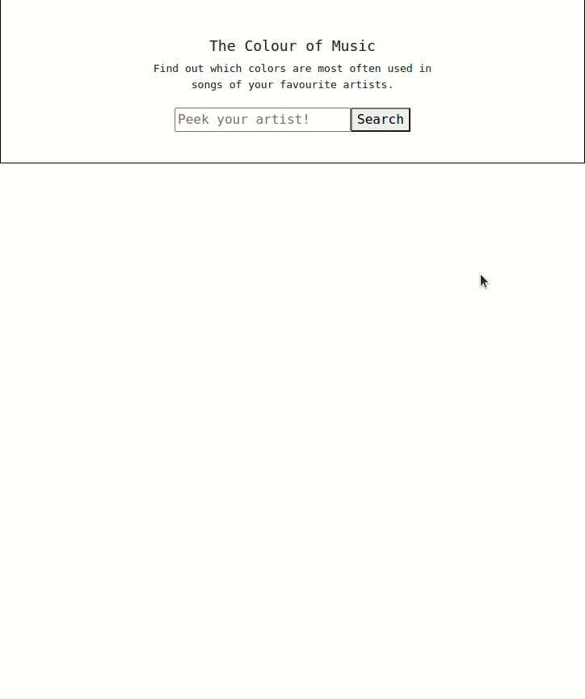

## The Colour of Music

This is small react component that helps to find out which colors are most often used in songs of your favourite artists.
You can feel free to use it in your projects!

Try it yourself: https://the-colour-of-music.herokuapp.com

Many thanks to https://happi.dev, which created best musical API!

Here's gif-demo, how it works:

PS. Also this app has more categories to count: swear words, good/evil, psychological. Check out code and word lists.
